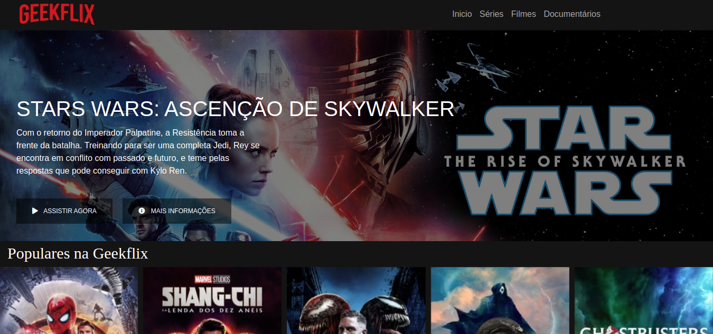

# Geekflix

<!---Esses são exemplos. Veja https://shields.io para outras pessoas ou para personalizar este conjunto de escudos. Você pode querer incluir dependências, status do projeto e informações de licença aqui--->




> Este projeto é baseado na Netflix, com conteudo voltado para cultura Nerd e Geek.
### Ajustes e melhorias

O projeto ainda está em desenvolvimento e as próximas atualizações serão voltadas nas seguintes tarefas:

- [x] Desenvolver tela principal
- [ ] Desenvolver tela para detalhes de filmes
- [ ] Criar sistema de login

## 💻 Pré-requisitos

Este projeto não possui nenhum pré-requisito.
<!--Antes de começar, verifique se você atendeu aos seguintes requisitos:
-Estes são apenas requisitos de exemplo. Adicionar, duplicar ou remover conforme necessário--->

<!---* Você instalou a versão mais recente de `<linguagem / dependência / requeridos>`
* Você tem uma máquina `<Windows / Linux / Mac>`. Indique qual sistema operacional é compatível / não compatível.
* Você leu `<guia / link / documentação_relacionada_ao_projeto>`.--->

<!---## ☕ Instalando Geekflix

Para instalar o Geekflix, siga estas etapas:

Linux e macOS:
```
<comando_de_instalação>
```

Windows:
```
<comando_de_instalação>
```
--->
## 🚀 Utilizando o Geekflix

Para utilizar o Geekflix, siga estas etapas:

1 - Para utilizar o projeto basta ter o **Visual Studio Code** instalado com a extensão **Live server**.  <br><br>
  1.1 - Intalando VS Code: https://www.youtube.com/watch?v=49K-Zxc8A7A  \
  1.2 - Instalando Live Server: https://www.youtube.com/watch?v=5pZOCXJp0C8  \

2 - Clique no `Index.html` e va em **Open to Live Sever**

OBS: Você pode utilizar outro servidor local como Wamp ou Xampp para utilizar o projeto
<!---
```
<exemplo_de_uso>
```

Adicione comandos de execução e exemplos que você acha que os usuários acharão úteis. Fornece uma referência de opções para pontos de bônus!
--->

## 📫 Contribuindo para Geekflix
<!---Se o seu README for longo ou se você tiver algum processo ou etapas específicas que deseja que os contribuidores sigam, considere a criação de um arquivo CONTRIBUTING.md separado--->
Para contribuir com Geekflix, siga estas etapas:

1. Bifurque este repositório.
2. Crie um branch: `git checkout -b <nome_branch>`.
3. Faça suas alterações e confirme-as: `git commit -m '<mensagem_commit>'`
4. Envie para o branch original: `git push origin <nome_do_projeto> / <local>`
5. Crie a solicitação de pull.

Como alternativa, consulte a documentação do GitHub em [como criar uma solicitação pull](https://help.github.com/en/github/collaborating-with-issues-and-pull-requests/creating-a-pull-request).

## 🤝 Colaboradores

<table>
  <tr>
    <td align="center">
      <a href="#">
        <br>
        <sub>
          <b>Giovane Fernandes</b>
        </sub>
      </a>
    </td>
  </tr>
</table>


## 😄 Seja um dos contribuidores<br>

Quer fazer parte desse projeto? Clique [AQUI](CONTRIBUTING.md) e leia como contribuir.

## 📝 Licença

Esse projeto está sob licença. Veja o arquivo [LICENÇA](LICENSE.md) para mais detalhes.

[⬆ Voltar ao topo](#nome-do-projeto)<br>
